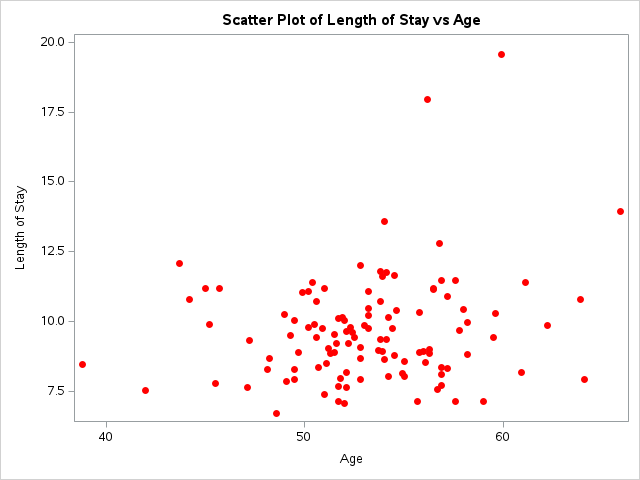
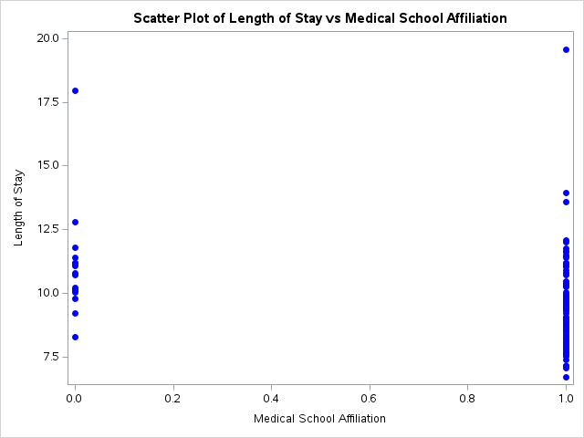
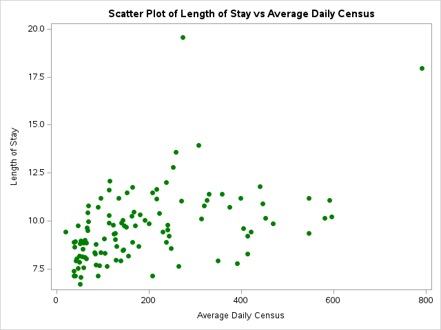
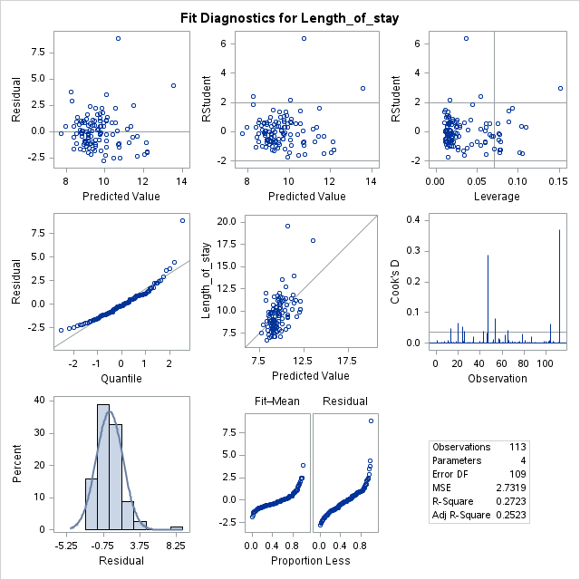
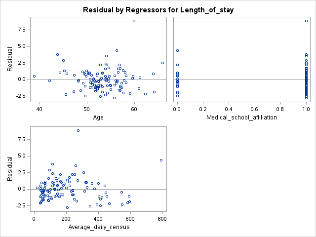
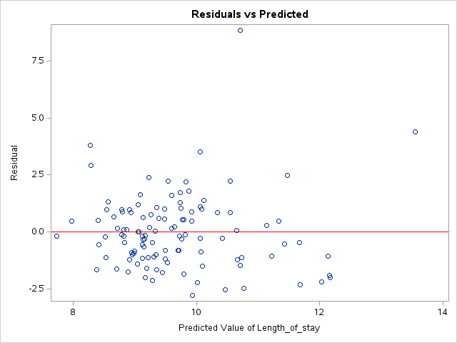
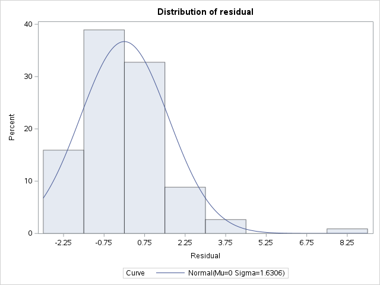
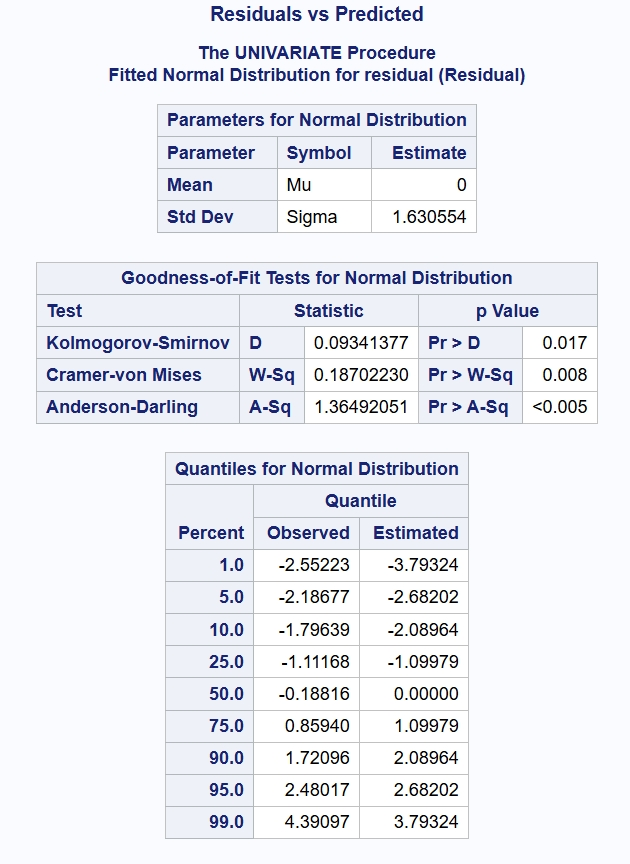
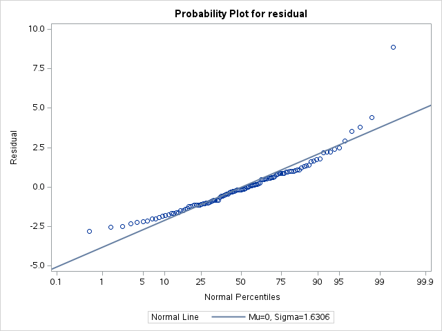

# ROAS5900 Homework

**Author** : [Yujie ZHOU](yzhou118@connect.hkust-gz.edu.cn) 50002814

# Qusetion 1

## Source Code
```
/* 1. 导入数据 */
data senic;
    infile '/home/u64085882/SENIC.txt' firstobs=1;
    input Id
          Length_of_stay
          Age
          Infection_risk
          Rculturing_r
          R_Xray_r
          Beds_number
          Medical_school_affiliation
          Region
          Average_daily_census
          Number_of_nurses
          Avai_facs_and_ser;
run;

/* Step 2: Create a new dataset with the selected columns */
data selected_data;
    set senic;
    keep Length_of_stay Age Medical_school_affiliation Average_daily_census;
run;

/* Step 3: Plot Length_of_stay against each of the other selected variables */

/* Plot Length_of_stay vs Age */
proc sgplot data=selected_data;
    title "Scatter Plot of Length of Stay vs Age";
    scatter x=Age y=Length_of_stay / markerattrs=(symbol=CircleFilled color=red);
    xaxis label="Age";
    yaxis label="Length of Stay";
run;

/* Plot Length_of_stay vs Medical_school_affiliation */
proc sgplot data=selected_data;
    title "Scatter Plot of Length of Stay vs Medical School Affiliation";
    scatter x=Medical_school_affiliation y=Length_of_stay / markerattrs=(symbol=CircleFilled color=blue);
    xaxis label="Medical School Affiliation";
    yaxis label="Length of Stay";
run;

/* Plot Length_of_stay vs Average_daily_census */
proc sgplot data=selected_data;
    title "Scatter Plot of Length of Stay vs Average Daily Census";
    scatter x=Average_daily_census y=Length_of_stay / markerattrs=(symbol=CircleFilled color=green);
    xaxis label="Average Daily Census";
    yaxis label="Length of Stay";
run;


/* Fit a linear regression model */
proc reg data=selected_data;
    model Length_of_stay = Age Medical_school_affiliation Average_daily_census;
    output out=reg_results p=predicted r=residual;
run;

/* Check model assumptions with diagnostic plots */
proc sgplot data=reg_results;
    title "Residuals vs Predicted";
    scatter x=predicted y=residual;
    refline 0 / axis=y lineattrs=(color=red);
run;

proc univariate data=reg_results normal;
    var residual;
    histogram residual / normal;
    probplot residual / normal(mu=est sigma=est);
run;

```

## Dataset
- SENIC (Study on the Efficacy of Nosocomial Infection Control) is a known healthcare-relevant dataset commonly used for instructional tasks in regression analysis or statistical modeling. This dataset typically contains information on hospitalizations, ages, and hospital-related characteristics.

### Scatter Plot of Length of Stay vs Age


### Scatter Plot of Length of Stay vs Age


### Scatter Plot of Length of Stay vs Age



## Scatter Plot of Length of Stay vs Average Daily Census - The REG Procedure

### Model Information
| Number of Observations Read | 113 |
| --- | --- |
| Number of Observations Used | 113 |

### Analysis of Variance
| Source | DF | Sum of Squares | Mean Square | F Value | Pr>F |
| --- | --- | --- | --- | --- | --- |
| Model | 3 | 111.43521 | 37.14507 | 13.60 | <.0001 |
| Error | 109 | 297.77517 | 2.73188 | - | - |
| Corrected Total | 112 | 409.21038 | - | - | - |

### Model Fit Statistics
| Root MSE | 1.65284 | R-Square | 0.2723 |
| --- | --- | --- | --- |
| Dependent Mean | 9.64832 | Adj R-Sq | 0.2523 |
| Coeff Var | 17.13087 | - | - |

### Parameter Estimates
| Variable | DF | Parameter Estimate | Standard Error | t Value | Pr>lt| 
| --- | --- | --- | --- | --- | --- |
| Intercept | 1 | 3.74416 | 1.92683 | 1.94 | 0.0546 |
| Age | 1 | 0.09466 | 0.03541 | 2.67 | 0.0087 |
| Medical_school_affiliation | 1 | -0.25886 | 0.55704 | -0.46 | 0.6431 |
| Average_daily_census | 1 | 0.00567 | 0.00129 | 4.40 | <.0001 |

### Scatter Plot of Length of Stay vs Age


### Scatter Plot of Length of Stay vs Age


### Scatter Plot of Length of Stay vs Age


## Residuals vs Predicted - The UNIVARIATE Procedure (Variable: residual)

### Basic Statistics
|Moments|  |  |  |
| --- | --- | --- | --- |
| N | 113 | Sum Weights | 113 |
| Mean | 0 | Sum Observations | 0 |
| Std Deviation | 1.63055415 | Variance | 2.65870684 |
| Skewness | 1.70640418 | Kurtosis | 6.97790768 |
| Uncorrected Ss | 297.775166 | Corrected SS | 297.775166 |
| Coeff Variation | - | Std Error Mean | 0.15338963 |

### Location and Variability Measures
| Location | | Variability | |
| --- | --- | --- | --- |
| Mean | 0.00000 | Std Deviation | 1.63055 |
| Median | -0.18816 | Variance | 2.65871 |
| Mode | - | Range | 11.65821 |
| - | - | Interquartile Range | 1.97107 |

### Tests


### Quantiles
| Level | Quantile |
| --- | --- |
| 100% Max | 8.856584 |
| 99% | 4.390969 |
| 95% | 2.480167 |
| 90% | 1.720956 |
| 75% Q3 | 0.859397 |
| 50% Median | -0.188158 |
| 25% Q1 | -1.111677 |
| 10% | -1.796386 |
| 5% | -2.186765 |
| 1% | -2.552228 |
| 0% Min | -2.801624 |

## Extreme Observations
### Lowest
| Value | Obs |
| --- | --- |
| -2.80162 | 1 |
| -2.55223 | 87 |
| -2.49158 | 26 |
| -2.32953 | 20 |
| -2.22933 | 65 |

### Highest
| Value | Obs |
| --- | --- |
| 2.91628 | 43 |
| 3.53014 | 34 |
| 3.79595 | 54 |
| 4.39097 | 112 |
| 8.85658 | 47 |

### Distribution of residual



###



### Probability Plot for residual



## Conclusion

# Regression Model Analysis Report

1. **Residual and Predicted Plots**
   - The residual plots show a generally random distribution around zero with a slight nonlinear tendency. This indicates that while the linear assumption holds to some extent, the model may not fully capture the complex relationships in the data.
2. **Normality**
   - The Q - Q plot and histogram suggest that the residuals are approximately normally distributed, which is beneficial for many statistical inference methods. However, slight deviations may still exist.
3. **Homoscedasticity**
   - The scatter plot of residuals and predicted values shows relatively constant variance with a slight heteroscedasticity, which could affect the precision of parameter estimates.
4. **Cook's D**
   - The absence of obvious high - leverage points in the Cook's D plot indicates good model stability without severe outliers.
5. **Model Goodness of Fit**
   - With an R - squared value of 0.2723 and an adjusted R - squared value of 0.2523, the model has relatively low explanatory power. Consider adding variables or using more complex models.

### Overall Conclusion
In general, the model mostly satisfies the assumptions but can be improved. Future efforts should focus on exploring additional variables, considering nonlinear models, and improving data processing to enhance accuracy and reliability for better prediction of the relationship between length of stay and related factors. Caution should be exercised in applying and interpreting the model due to its limitations.


# Question 2


