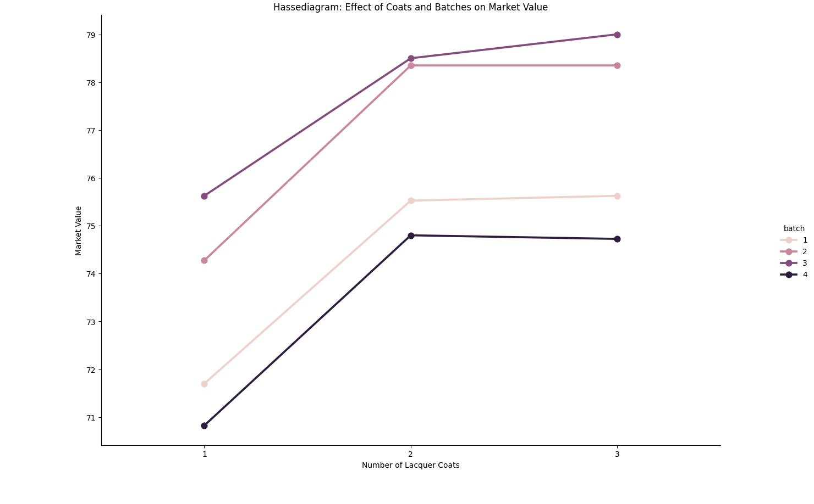
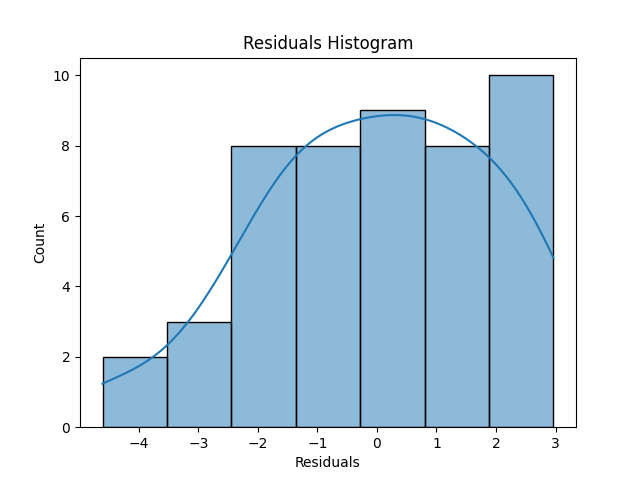
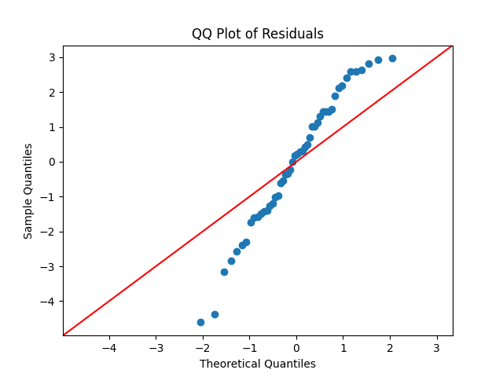
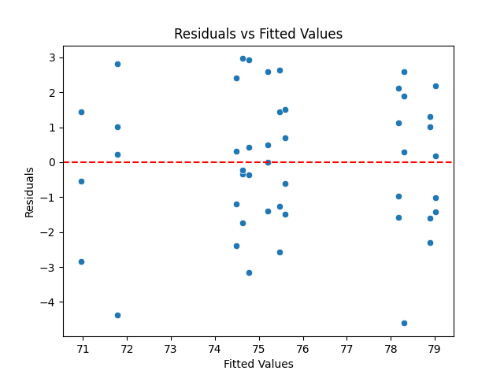

# ROAS5900 Homework

**Author** : [Yujie ZHOU](yzhou118@connect.hkust-gz.edu.cn) 50002814

# Qusetion 1

## Source Code
```
import pandas as pd
from sklearn.model_selection import train_test_split
from sklearn.linear_model import LinearRegression
from sklearn.metrics import mean_squared_error, r2_score

# 1. 加载数据
# 假设数据是空格分隔
columns = ["index", "length_of_stay", "age", "med_school", "avg_daily_census", "other1", "other2", "other3", "other4", "other5", "other6", "other7"]
data = pd.read_csv("SENIC.txt", sep="\s+", header=None, names=columns)

# 提取需要的变量
df = data[["length_of_stay", "age", "med_school", "avg_daily_census"]]

# 检查数据
print(df.info())

# 2. 划分训练集和测试集
X = df[["age", "med_school", "avg_daily_census"]]
y = df["length_of_stay"]

X_train, X_test, y_train, y_test = train_test_split(X, y, test_size=0.2, random_state=42)

# 3. 构建线性回归模型
model = LinearRegression()

# 拟合模型
model.fit(X_train, y_train)

# 4. 预测
y_pred = model.predict(X_test)

# 5. 评估模型性能
mse = mean_squared_error(y_test, y_pred)
r2 = r2_score(y_test, y_pred)


# 输出结果
print("回归系数:", model.coef_)
print("截距:", model.intercept_)
print("均方误差 (MSE):", mse)
print("R² 得分:", r2)

# 6. 输出模型系数对应解释
coefficients = pd.DataFrame({"Feature": X.columns, "Coefficient": model.coef_})
print(coefficients)

```

## Dataset
- SENIC (Study on the Efficacy of Nosocomial Infection Control) is a known healthcare-relevant dataset commonly used for instructional tasks in regression analysis or statistical modeling. This dataset typically contains information on hospitalizations, ages, and hospital-related characteristics.

- It is explicitly mentioned in the assignment to predict length_of_stay (length of stay), using explanatory variables including age (age), med_school (medical school affiliation), and avg_daily_census (daily number of patients).

- med_school is often designed to indicate whether there is an affiliation with a medical school (a binary variable of 1 or 0).

## Result

### Regression Coefficients
| Feature                | 	CoefficientCoefficient |
|---------------------|-------------------------|
| Age (`age`)        | 0.0937                 |
| Medical School Affiliation (`med_school`) | 0.6587                 |
| Average Daily Census (`avg_daily_census`) | 0.0132                 |

### Interpretation：
- For every 1-year increase in age, the length of stay increases by 0.0937 days.
- Patients affiliated with a medical school stay 0.6587 days longer on average.
- For every 1-unit increase in the average daily census, the length of stay increases by 0.0132 days.

### Intercept
- Intercept: 1.5401


### Model Performance
- **Mean Squared Error (MSE):**：`3.3304`  
- **R² Score**：`0.3390`  


# Qusetion 2
## Source Code
```
import pandas as pd
import statsmodels.api as sm
from statsmodels.formula.api import ols
import matplotlib.pyplot as plt
import seaborn as sns
from scipy import stats

# 1. 加载数据
columns = ["market_value", "lacquer_coats", "batch", "replicate"]
data = pd.read_csv("CH25PR17.txt", sep="\s+", header=None, names=columns)

# 显示数据基本信息
print(data.head())
print(data.info())

# 2. 构建Hassediagram
# 可视化实验设计
sns.catplot(data=data, x="lacquer_coats", y="market_value", hue="batch", kind="point", ci=None)
plt.title("Hassediagram: Effect of Coats and Batches on Market Value")
plt.xlabel("Number of Lacquer Coats")
plt.ylabel("Market Value")
plt.show()

# 3. 方差分析 (ANOVA)
# 定义公式: market_value ~ C(lacquer_coats) + C(batch)
model = ols("market_value ~ C(lacquer_coats) + C(batch)", data=data).fit()
anova_table = sm.stats.anova_lm(model, typ=2)

# 输出方差分析结果
print("ANOVA Table:")
print(anova_table)

# 4. 模型残差分析
# 残差提取
residuals = model.resid

# (a) 正态性检验
sns.histplot(residuals, kde=True)
plt.title("Residuals Histogram")
plt.xlabel("Residuals")
plt.show()

# QQ图
sm.qqplot(residuals, line="45")
plt.title("QQ Plot of Residuals")
plt.show()

# (b) 同方差性检验
fitted_values = model.fittedvalues
sns.scatterplot(x=fitted_values, y=residuals)
plt.axhline(0, color="red", linestyle="--")
plt.title("Residuals vs Fitted Values")
plt.xlabel("Fitted Values")
plt.ylabel("Residuals")
plt.show()

# (c) 独立性检验
dw_stat = sm.stats.durbin_watson(residuals)
print(f"Durbin-Watson Statistic: {dw_stat}")

# 5. 输出模型结果
print("Model Summary:")
print(model.summary())

```

## Result

**Hassediagram: Effect of Coats and Batches on Market Value**


### ANOVA Table
|           |      sum_sq       |  df   |      F  |  PR(>F)|
|---------- |-----------------|------------|------------|-------------|
|C(lacquer_coats) | 150.387917 |  2.0   | 17.997485 | 0.000002    |
|C(batch)   |       152.851667 |  3.0   | 12.194888 | 0.000007    |
|Residual    |      175.477083 | 42.0   |    NaN   |    NaN      |

### Residuals Histogram


### QQ Plot of Residuals


### Residuals vs Fitted Values



### Model Summary

> Code output
```
                            OLS Regression Results
==============================================================================
Dep. Variable:           market_value   R-squared:                       0.633
Model:                            OLS   Adj. R-squared:                  0.590
Method:                 Least Squares   F-statistic:                     14.52
Date:                Mon, 18 Nov 2024   Prob (F-statistic):           2.91e-08
Time:                        23:36:27   Log-Likelihood:                -99.220
No. Observations:                  48   AIC:                             210.4
Df Residuals:                      42   BIC:                             221.7
Df Model:                           5
Covariance Type:            nonrobust
=========================================================================================
                            coef    std err          t      P>|t|      [0.025      0.975]
-----------------------------------------------------------------------------------------
Intercept                71.7813      0.723     99.328      0.000      70.323      73.240
C(lacquer_coats)[T.2]     3.6875      0.723      5.103      0.000       2.229       5.146
C(lacquer_coats)[T.3]     3.8187      0.723      5.284      0.000       2.360       5.277
C(batch)[T.2]             2.7083      0.834      3.246      0.002       1.024       4.392
C(batch)[T.3]             3.4250      0.834      4.104      0.000       1.741       5.109
C(batch)[T.4]            -0.8333      0.834     -0.999      0.324      -2.517       0.851
==============================================================================
Omnibus:                        1.614   Durbin-Watson:                   2.724
Prob(Omnibus):                  0.446   Jarque-Bera (JB):                1.571
Skew:                          -0.363   Prob(JB):                        0.456
Kurtosis:                       2.492   Cond. No.                         5.35
==============================================================================

Notes:
[1] Standard Errors assume that the covariance matrix of the errors is correctly specified.
```

The Durbin-Watson statistic is a test statistic used to detect the presence of autocorrelation (correlation of a variable with itself over successive time intervals) in the residuals from a regression analysis.  It ranges from 0 to 4:
> Durbin-Watson Statistic: 2.7237342295013183

### Conclusion

The Ordinary Least Squares (OLS) regression analysis conducted on the dataset reveals that the model explains approximately 63.3% of the variance in market value, indicating a relatively strong fit. The overall model is statistically significant, as evidenced by an F-statistic of 14.52 and a p-value of 2.91e-08, suggesting that at least one of the independent variables significantly affects market value.

Specifically, the coefficients for lacquer coats at levels 2 and 3, as well as for batch levels 2 and 3, are all statistically significant, indicating that these factors positively influence market value. In contrast, batch level 4 does not show a significant effect on market value.

Additionally, the residual analysis indicates that the assumptions of the regression model are largely satisfied, as the Durbin-Watson statistic of 2.724 suggests no autocorrelation among the residuals. Overall, the findings highlight the importance of lacquer coats and batch levels in determining market value, while confirming the model's adequacy and reliability.

# Qusetion 3
The statement made by the student reflects a common misunderstanding about the implications of adding predictor variables to a regression model. While it is true that adding a predictor variable will not decrease R-squared (\(R^2\)), the conclusion that one should include all available predictor variables in the model is misguided. Here are several important points to consider:

### 1. **Behavior of R-squared**:
- **Definition**: \(R^2\) measures the proportion of variance in the dependent variable that is explained by the independent variables in the model. When a new predictor is added, \(R^2\) can only stay the same or increase because the new predictor can explain additional variance.
  
### 2. **Adjusted R-squared**:
- **Adjusted R-squared**: Unlike \(R^2\), adjusted \(R^2\) accounts for the number of predictors in the model and adjusts for the potential inflation of \(R^2\) when adding variables. It can decrease if the new predictor does not improve the model significantly. This is a more reliable metric for evaluating model performance, especially when comparing models with different numbers of predictors.

### 3. **Overfitting**:
- **Risk of Overfitting**: Including all available predictors can lead to overfitting, where the model captures noise in the data rather than the underlying relationship. An overfitted model may perform well on the training dataset but poorly on new or unseen data, as it becomes too complex.
  
### 4. **Statistical Significance**:
- **Irrelevant Predictors**: Not all available predictor variables are necessarily relevant or statistically significant. Including irrelevant predictors can introduce noise and complicate the model, making it harder to interpret and potentially leading to misleading conclusions.

### 5. **Model Parsimony**:
- **Simplicity vs. Complexity**: A simpler model with fewer predictors may be preferable, as it is easier to interpret and may generalize better to other datasets. The principle of parsimony suggests that one should aim for the simplest model that adequately explains the data.

### Conclusion:
In summary, while adding a predictor variable to a regression model will not decrease \(R^2\), the decision to include all available predictor variables should be made cautiously. It is essential to consider adjusted \(R^2\), the risk of overfitting, the statistical significance of predictors, and the principle of model parsimony. A well-constructed model balances complexity and interpretability, ensuring that it accurately reflects the underlying relationships in the data without overfitting.


# Statement
In this assignment, my code and analysis were assisted by GPT. I utilized this tool to gain insights into data analysis, modeling, and programming. However, the final report and results were completed and reviewed by me to ensure the accuracy and integrity of the content.